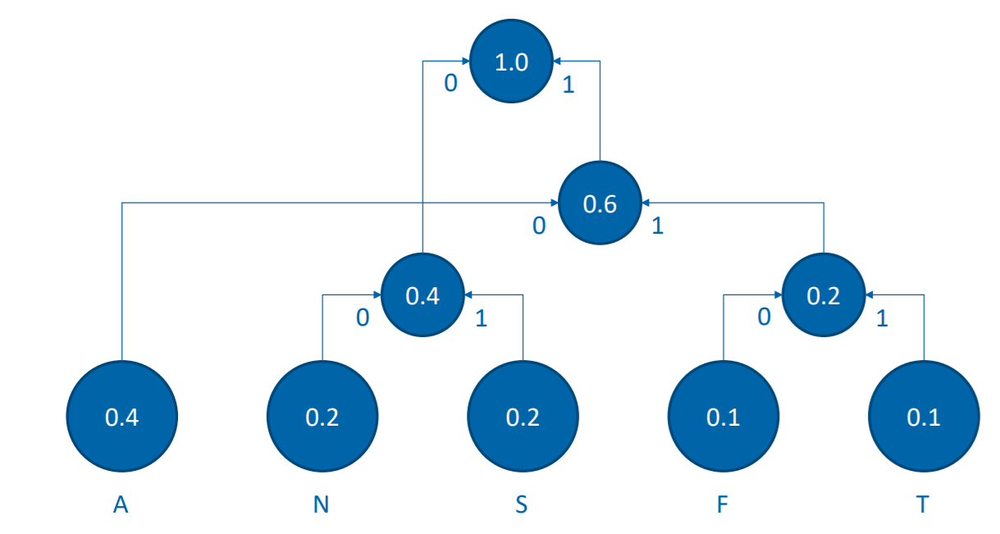

<!--
import: https://github.com/liascript/CodeRunner
-->

# Huffman coding
| Parameter                | Course Information |
| - | - |
| **Event:** | `Einführung in die Fachsprache` |
| **Semester** |  `Sommersemester 2021` |
| **University:** | `Technische Universität Bergakademie Freiberg` |
| **Content:**  | `Description and implementation of Huffman coding` |
| **Link to GitHub:** | [https://github.com/Yan0sch/HuffmanCode](https://github.com/Yan0sch/HuffmanCode) |
| **Autoren** | @author |

## General
{{0}}
The Huffman code is a kind of entropy encoding, which was developed by David A. Huffman and published in the 1952 paper "A Method for the Construction of Minimum-Redundancy Codes". It is ad type of prefix code that is commonly used for data compression.

{{1}}
The Huffman code is often used as back-end to other compression methods. For example Deflate (ZIP) and also multimedia codecs such as JPEG and MP3 make use of prefix-codes, which were called "Huffman codes". Note that most application use pre-defined codes instead of codes that were created with Huffman's algorithm.

{{2}}
The basic approach is that more common symbols are represented by less bits than less common symbols. The Huffman code is a method to for choosing a representation for each symbol, resulting in a prefix code (also prefix-free code). But the term Huffman code is widely used as synonym for "prefix code" even when the code is not produced by Huffman's algorithm.

**This presentation is not about prefix codes in general but about Huffman's algorithm.**

## How it works
### Basics

* messages with property p → p determines the information content
* self-information I = -ld p
* Example coin toss:
  * p(Head) = 1/2, p(Number) = 1/2
  * I(Head) = -ld(1/2) = 1 bit
* Example word "ANANASSAFT":
  * p(a) = 2/5 → I(A) = -ld(2/5) = 1.32 bit
  * p(F) = 1/10 → I(F) = -ld(1/10) = 3.32 bit
  * entropy (avg information content) H = 2.12 bits
So you see the more often a symbol the smaller the information content. The ideal case is that the length of the code word match the information content.

### Huffman tree

* create a node for each symbols
* combine two subtrees with the minimum properties to a new subtree and add their properties (if properies are equal choose those subtrees with the lowest depth)
* at the end: go from the root backwards through the tree, label the nodes with 0 or 1 and read the codewords.

Example: ANANASSAFT

So you get the following codes:
| Symbol | Code |
| -- | -- |
| A | 10 |
| N | 00 |
| S | 01 |
| F | 110 |
| T | 111 |

* ANANASSAFT := 100010001000010110110111
* Length = 24 bits
* entropy H = 2.4 bits
* Uncompressed Length (each symbol 8 bit) = 80 bits
